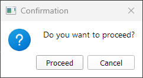
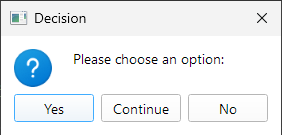
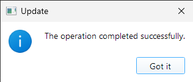
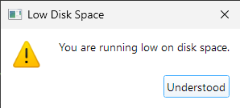
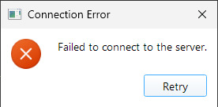
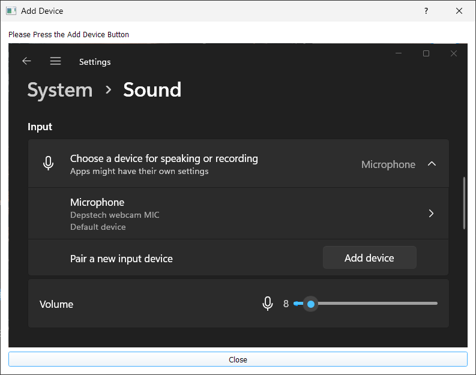
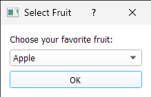

# Thread-Safe PyQt Message Boxes

This repository contains `qt_user_massages.py`, which provides thread-safe message boxes in PyQt or for general applications.
It detects if you're on the main thread or not, and creates a message box accordingly. 
This also works if no existing PyQt application is running, by creating a lightweight pseudo-instance automatically.
Can be fully customizable buttons.

## Features

- **Thread-Safe**: Call message boxes from any thread and safely display them on the main thread.
- **Works Without Existing QApplication**: If you’re running in a terminal-only scenario, it spins up a hidden PyQt app instance for you.
- **Multiple Dialog Types**: 
    - Yes/No:

        

    - Yes/No/Continue

        

    - Info

        

    - Warning

        

    - Error

        

    - Instruction (Shows a QDialog box with a given Image)

        

    - ComboBox for user selection from a list

        


## Requirements

- Python 3.x
- **PyQt5** (you can install via `pip install PyQt5`)

## Quick Start

1. **Install dependencies**:

   ```bash
   pip install PyQt5
   ```

2. **Use the Script:**

    ``` Python 
    from qt_user_massages import MessageBoxHandler

    handler = MessageBoxHandler()
    user_clicked_yes = handler.yes_no_message(
        title="Confirm",
        content="Proceed with the operation?"
    )
    if user_clicked_yes:
        print("User chose YES")
    else:
        print("User chose NO")
    ```

3. **Run It:**
    See Script if main block for full examples for all massages types or run it.

    ``` Python
    python qt_user_massages.py
    ```

## License
    This project is licensed under the MIT License - see the LICENSE file for details.

## Want to contribute
    Feel free to open issues or pull requests if you’d like to improve anything!
